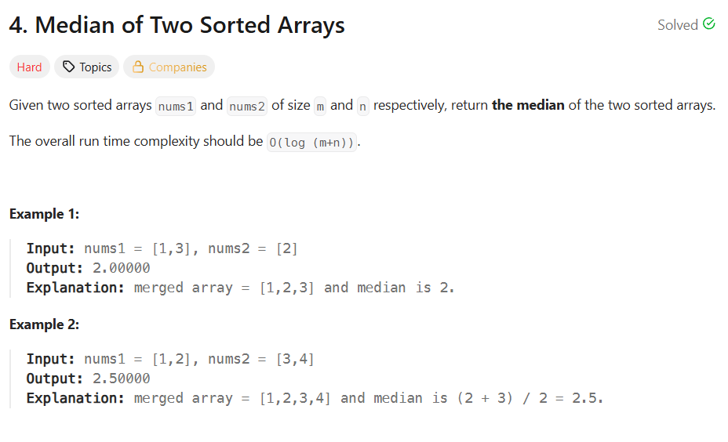
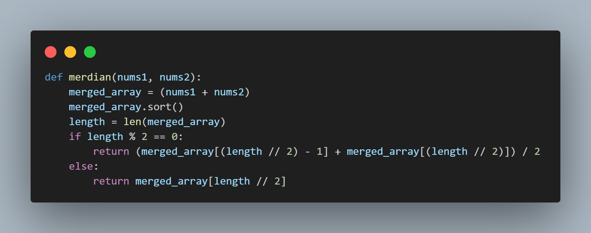
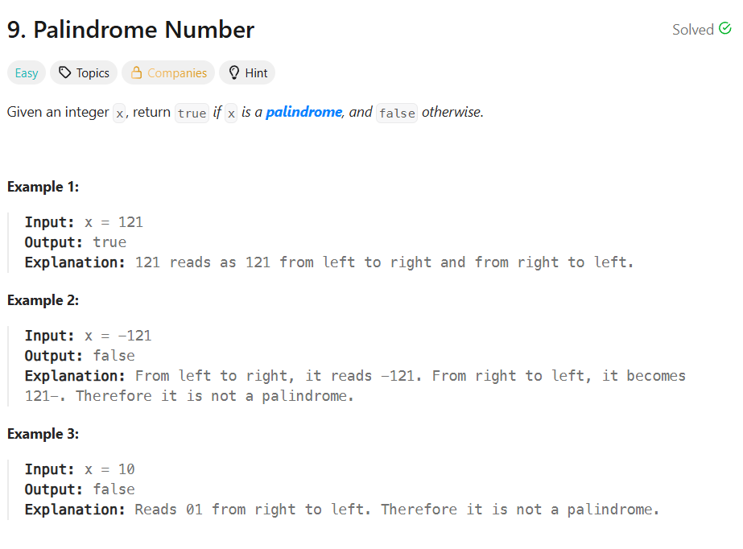
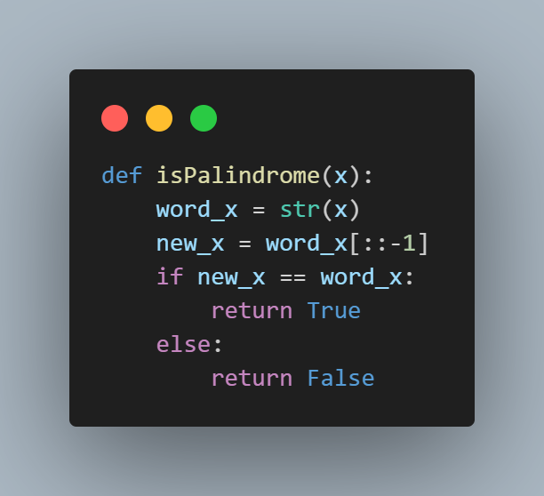
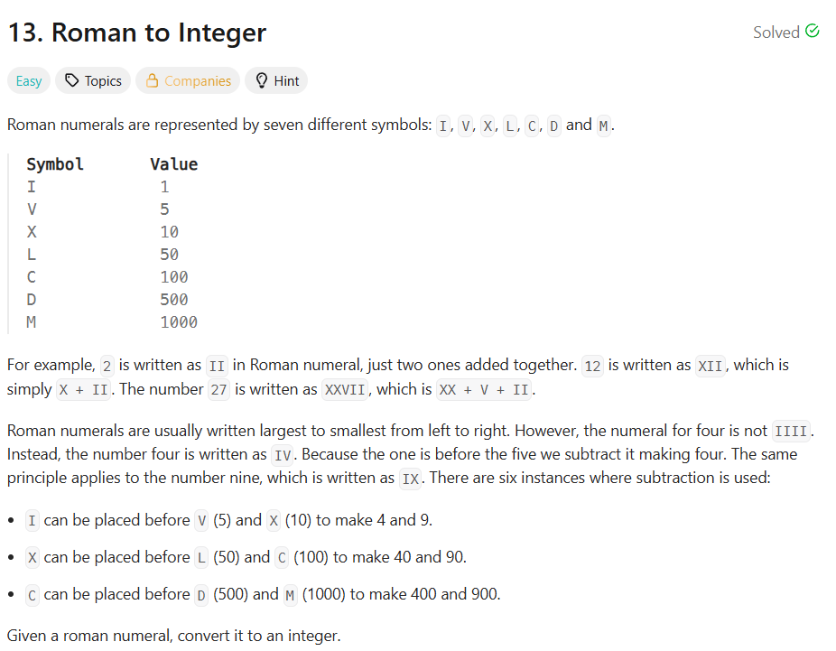
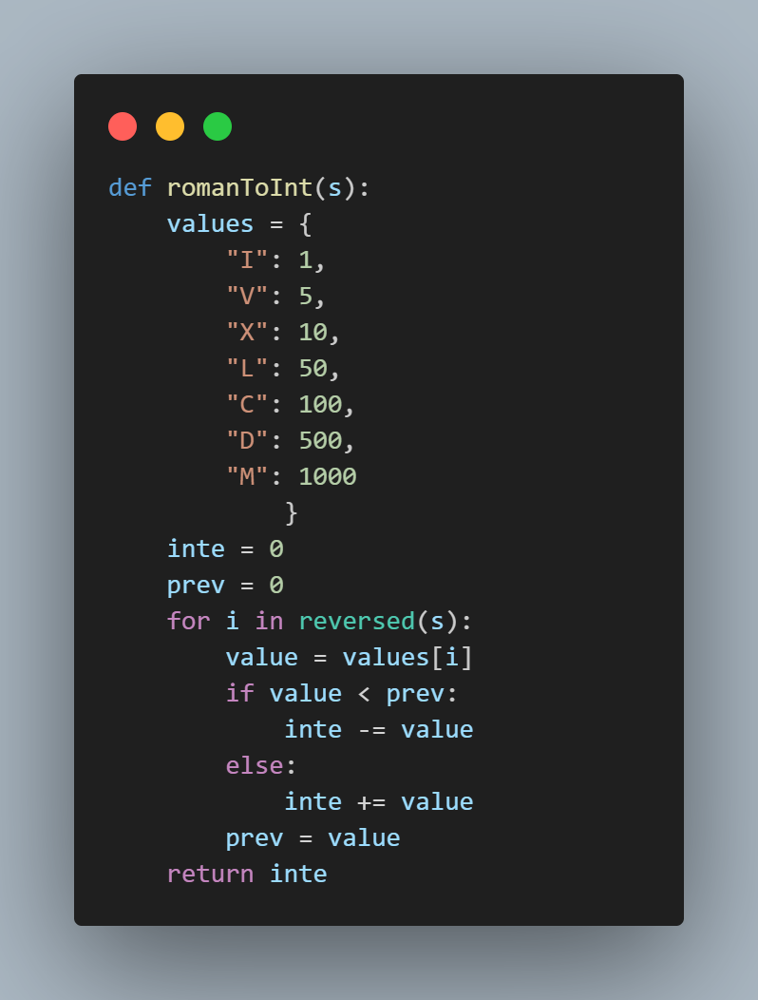

uhh ill try to somehow explain my thought process behind my leetcode solutions :O

# Two Sum

**Of course, the infamous leetcode welcomer lmao, I actually took longer here than the other problem sets**

**Solution**

- Since the problem involves both the index and the value, I used a dictionary to store them and enum() function the loop through the index and the value.

- In looping, it gets the number needed to equal to the target then stores it in the *diff* variable.

- It then checks if the *diff* and it's index has been checked before. If yes, which means its the number thats needed, then it returns the index of the diff and the index of the current number.

- If not, it assigns the index(i) as the value of the current number and stores both in the *numbers* dictionary.

# Median of Two Sorted Arrays

**This was actually pretty easy.**

**Solution**

- Since the problem involves arrays, it obviously deals with indexes.

- I first joined the two arrays and stored them in the *merged_array* variable then used the sort() function to sort the merged. You can also use the inline sort function but I forgot about it that time lmao.

- I then get the length of the *merged_array*, if it's even then that means there's two numbers at the middle and I'd have to add those two the divide by 2.

- If not even, then I simply get the middle value by halfing the length then using that in the index.

# Palindrome Number

**I did some unnecessary things here lol.**

**Solution**

- In order to check if the number is a palindrome, my first thought was to convert it into a string.

- After converting, you can use the ::-1 to reverse strings in python.

- I then check if the reversed is the same as the original, like a palindrome.

- If yes, i return true, if not thenn false. I actually didnt need to write if conditions here and I could just return using == to get true or false lmao my fault.

# Roman to Integer

**This was actually hard lmao, I stared at my screen for like an hour lol. Roman numerals are quirky because of the minus if the small letter came first.**

**Solution**

- I peeked at the clue since I was staring for far too long lmao. It said that its easier to solve if I start solving from the end.

- I used a dictionary since certain numerals has corresponding values in them.

- *inte* variable is for the total while *prev* checks for the case where it minuses instead like IV.

- I first store the corresponding value of the roman to *value* then I check if the previous checked number is larger than the current number, if it is, I minus it to the value.

- If not, then I simply add it to the *inte* then make the current number to be the prev for checking the next number.

            

