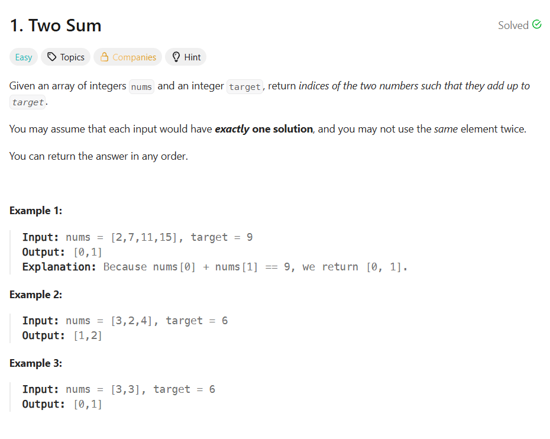
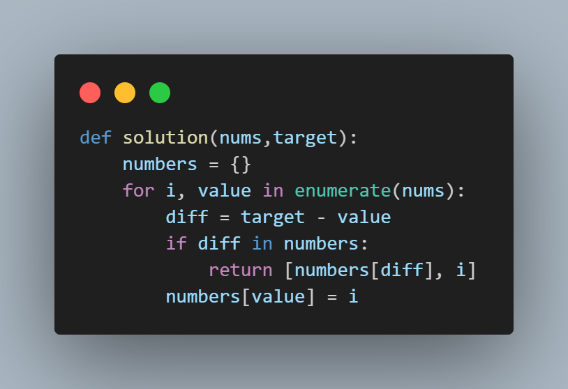

uhh ill try to somehow explain my thought process behind my leetcode solutions :O

# Two Sum

**Of course, the infamous leetcode welcomer lmao, I actually took longer here than the other problem sets**

**Solution**

- Since the problem involves both the index and the value, I used a dictionary to store them and enum() function the loop through the index and the value.

- In looping, it gets the number needed to equal to the target then stores it in the **diff* variable.

- It then checks if the number and it's index has been checked before. If yes, then it returns the index of the diff and the index of the current number.

- If not, it assigns the index(i) as the value of the current number and stores both in the numbers dictionary.

            

